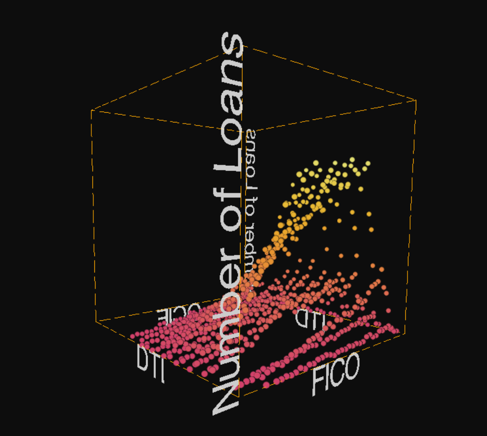

# HoloLens Credit Box Demo

3D demo of the credit box (FICO, DTI, and acquisition volume) across acquisition months, based on Fannie Mae [LPPUB data](https://loanperformancedata.fanniemae.com/lppub/index.html).

Built using [HoloJS](https://github.com/microsoft/HoloJS) and [Three.js](https://threejs.org) with no additional libraries. 3D scatter chart written purely in Three.js.

